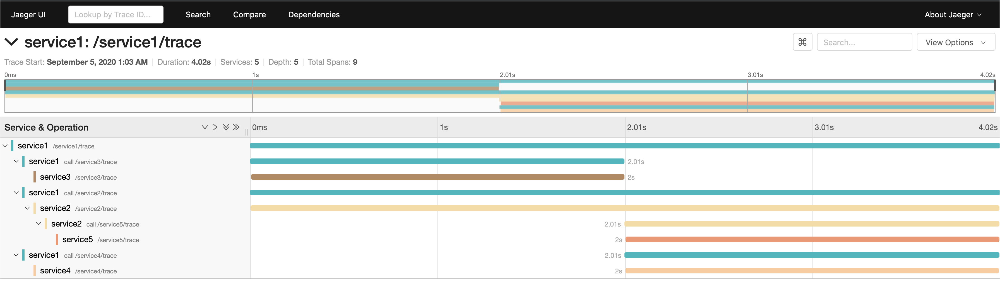

# Golang opentracing example with gin (WORKING!!)  

this project is example of opentracing-go with gin, jagger  

---  

## Overview

Suppose that we have 5 services like below tree.

> Service to service calls

```  
             [Span A (Service1)]  
                     |  
         +-----------+-----------+  
         |                       |  
 [Span B (Service2)]      [Span C (Service 3)] >>> [Span D (Service 4)]  
         |                   
 [Span E (Service5)]
```  

## Getting started  

> #### Run with docker compose  

```bash
// jaeger ui with `:16686`
// service1 with `:3100`
// service2 with `:3200`
// service3 with `:3300`
// service4 with `:3400`
// service5 with `:3500`
$ docker-compose up

// if u want to build image again, use --build tag
$ docker-compose up --build
```  

> #### Call /service1/trace  

```bash
$ curl -XGET http://localhost:3100/service1/trace
```  

> #### Check span from jaeger ui (http://localhost:16686/)  

  

---  

## References  

- https://opentracing.io
